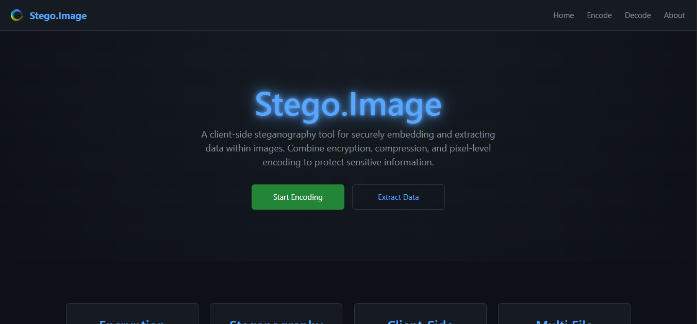
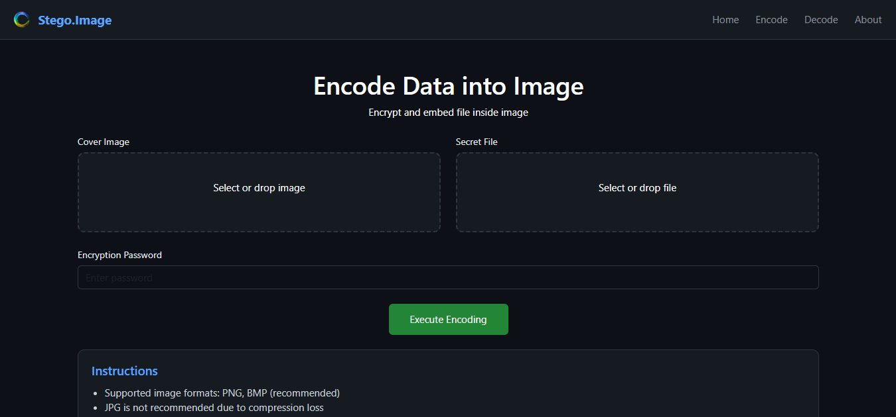
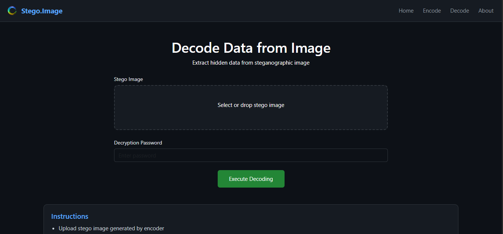

# 🖼️ Stego.Image

A powerful **client-side steganography web app** that allows users to **hide and extract any file inside an image securely** using encryption and compression.

Working Link :-

---

## 🚀 Features

* 🔐 **Password Protection**
  Secure hidden data using AES encryption

* 📦 **File Compression**
  Reduce file size before embedding using gzip

* 🖼️ **Image Steganography (LSB)**
  Hide data inside image pixels without visible changes

* 📂 **Supports Any File Type**
  (PDF, ZIP, TXT, Images, etc.)

* 🔓 **Data Extraction**
  Retrieve hidden files using the correct password

* 🌐 **100% Frontend (No Backend)**
  All processing happens in the browser

---

## 🧠 How It Works

### 🔒 Encoding Process

```
File → Compress → Encrypt → Convert to Binary → Hide in Image (LSB)
```

### 🔓 Decoding Process

```
Image → Extract Binary → Decrypt → Decompress → Original File
```

---

## 🛠️ Tech Stack

* ⚛️ React (Vite)
* 🎨 Bootstrap
* 🔐 crypto-js (AES Encryption)
* 📦 pako (Compression)
* 💾 file-saver


---

## ⚙️ Installation & Setup

```bash
# Clone repository
git clone https://github.com/your-username/stego.image.git

# Go to project folder
cd stego.image

# Install dependencies
npm install

# Run project
npm run dev
```

Open in browser:

```
http://localhost:5173
```

---

## 📌 Usage

### 🔹 Encode (Hide Data)

1. Upload an image
2. Upload secret file
3. Enter password
4. Click **Encode**
5. Download stego image

---

### 🔹 Decode (Extract Data)

1. Upload stego image
2. Enter password
3. Click **Decode**
4. Download hidden file

---

## 🔐 Security Notes

* Data is encrypted using **AES**
* Without the correct password → data is unreadable
* No server → no data leaves your device

---

## ⚠️ Limitations

* Image must be large enough to hold data
* Large files may fail due to capacity limits
* Works best with **PNG images**

---

## 🌟 Future Enhancements

* ✅ Drag & Drop Upload
* ✅ Multi-file support (ZIP)
* ✅ QR code sharing
* ✅ Progress bar & UI improvements

---

## 📸 Screenshots

Home


Encode



Decode


---

## 📄 License

This project is currently private.
License will be added when made public.

---

## 👨‍💻 Author

**Rishu**

---

## ⭐ Support

If you like this project, consider giving it a ⭐ on GitHub!

---
